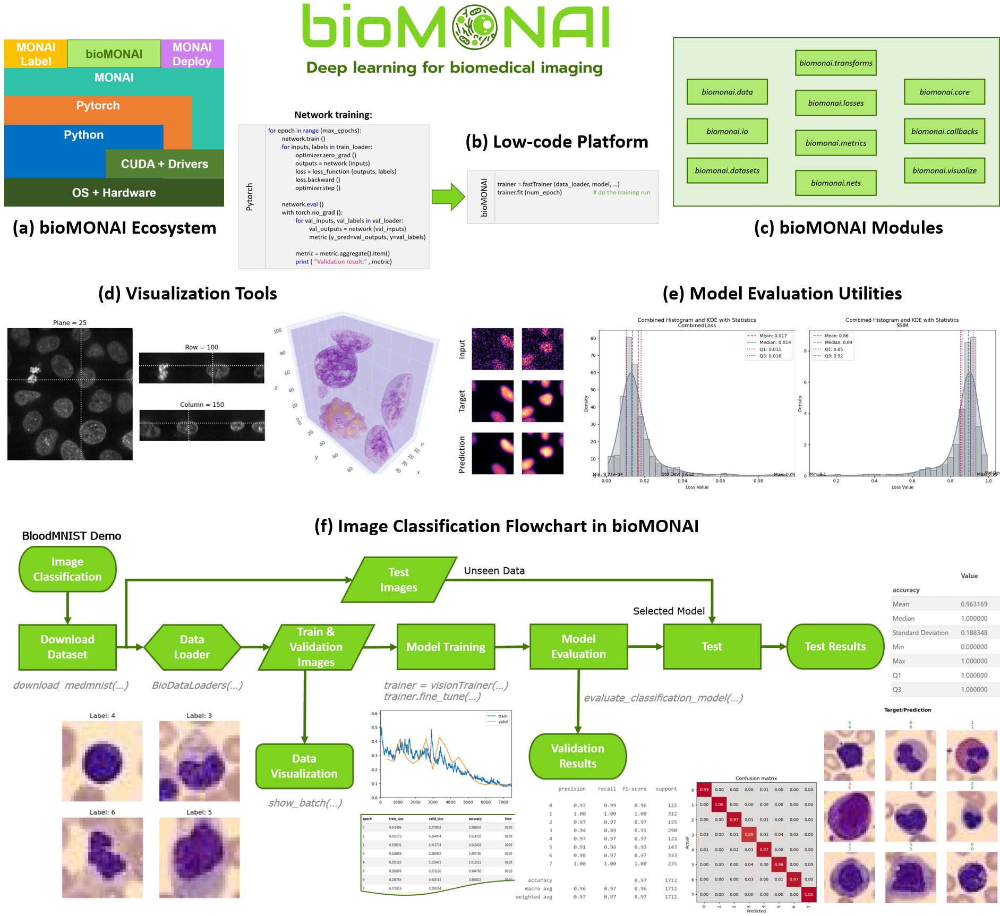

# bioMONAI


<!-- WARNING: THIS FILE WAS AUTOGENERATED! DO NOT EDIT! -->


[](https://deepclem.github.io/bioMONAI/)
[](https://opensource.org/licenses/Apache-2.0)


## Overview

bioMONAI is a low-code Python-based platform for developing and
deploying deep learning models in biomedical imaging built on top of the
[MONAI](https://monai.io/) framework,
[fastai](https://github.com/fastai/fastai), and
[TorchIO](https://torchio.readthedocs.io/). This project aims to
facilitate interoperability, reproducibility, and community
collaboration in biomedical research.



## Table of Contents

- [bioMONAI](#biomonai)
  - [Overview](#overview)
  - [Table of Contents](#table-of-contents)
  - [Installation](#installation)
  - [Getting Started](#getting-started)
  - [Usage](#usage)
  - [Contributing](#contributing)
  - [License](#license)
  - [Contact](#contact)

## Installation

Before starting, ensure you have **Conda** installed
([Anaconda](https://www.anaconda.com/) or
[Miniconda](https://docs.conda.io/en/latest/miniconda.html)) on your
system.

For **Windows** users, it is **highly recommended to install and run
BioMONAI within [WSL2 (Windows Subsystem for Linux
2)](https://learn.microsoft.com/en-us/windows/wsl/install)** for optimal
compatibility and performance. Additionally, ensure that the NVIDIA CUDA
toolkit is properly installed inside WSL2 and that the `nvcc` compiler
is available in your environment (`nvcc --version` should return the
installed version).

------------------------------------------------------------------------

### Installation Steps

1.  **Clone the repository:**

    ``` bash
    git clone https://github.com/deepclem/biomonai.git
    cd biomonai
    ```

2.  **Create a new Conda environment and install dependencies:**

    ``` bash
    conda env create -f bioMONAI-linux.yml
    ```

3.  **Activate the environment and install BioMONAI in editable mode:**

    ``` bash
    conda activate bioMONAI-env
    pip install -e .
    ```

------------------------------------------------------------------------

### Notes:

- If you are not using WSL2 on Windows, some functionalities may not
  work as expected.

- Make sure your system’s CUDA installation is compatible with PyTorch
  and MONAI.

- You can verify CUDA availability with:

  ``` bash
  nvcc --version
  ```

- Replace `bioMONAI-linux.yml` with a different environment file if
  you’re using another OS or configuration.

## Getting Started

To get started with bioMONAI, we recommend exploring our tutorials,
which guide you through model training for various tasks such as
classification and denoising.

| Notebook | Open in Colab |
|:---|:--:|
| [Tutorial: Classification 2D](https://github.com/deepCLEM/bioMONAI/blob/main/nbs/Tutorials/901_tutorial_classification.ipynb) <br> This notebook provides a comprehensive guide on training deep learning models for 2D image classification tasks, covering data loading, preprocessing, model building, training, and evaluation. | [](https://githubtocolab.com/deepCLEM/bioMONAI/blob/main/nbs/Tutorials/901_tutorial_classification.ipynb) |
| [Tutorial: Denoising 2D](https://github.com/deepCLEM/bioMONAI/blob/main/nbs/Tutorials/903_tutorial_denoising.ipynb) <br> This notebook offers a detailed guide on applying deep learning techniques to denoise biological microscopy images. It covers data preparation, model architecture, training processes, and evaluation methods, providing a comprehensive resource for enhancing image quality in biological research. | [](https://githubtocolab.com/deepCLEM/bioMONAI/blob/main/nbs/Tutorials/903_tutorial_denoising.ipynb) |

## Usage

To use bioMONAI for your own projects, follow these steps:

1.  **Create a new Jupyter notebook or open an existing one.**

2.  **Import necessary modules:**

    ``` python
    import bioMONAI
    ```

3.  **Start coding! You can now leverage MONAI’s capabilities alongside
    the interactive features of Jupyter notebooks.**

## Contributing

We welcome contributions from the community! To contribute to BioMONAI
nbs, follow these steps:

1.  **Fork the repository on GitHub.**

2.  **Clone your fork:**

    ``` bash
    git clone https://github.com/your_username/biomonai.git
    cd biomonai
    ```

3.  **Create a new Conda environment and install dependencies:**

    ``` bash
    conda env create --file bioMONAI-env.yml
    ```

4.  **Activate the environment and install MONAI in dev mode:**

    ``` bash
    conda activate bioMONAI-env
    pip install -e .[dev]
    ```

5.  **Create a new branch for your changes:**

    ``` bash
    git checkout -b feature/new-feature
    ```

6.  **Make your changes and commit them:**

    ``` bash
    git add .
    git commit -m "Add new feature: <feature description>"
    ```

7.  **Push to your fork and create a pull request on GitHub.**

8.  **Wait for the review, and merge if everything looks good!**

## System Requirements

BioMONAI is built on top of [MONAI](https://monai.io/) and
[fastai](https://www.fast.ai/), leveraging their core functionalities
while adding features to simplify and enhance the use of AI models in
biomedical applications. Despite these additional features, BioMONAI
does not introduce extra computational overhead beyond what is required
by the underlying frameworks.

As such, the system requirements are aligned with those recommended by
MONAI:

- RAM: Minimum 32 GB

- Storage: Minimum 50 GB of available SSD space

- GPU: Highly recommended for efficient training and inference

  - Compatible with NVIDIA GPUs supporting CUDA

  - At least 8 GB of GPU memory recommended

- CPU: Supported, but significantly slower execution compared to GPU

- Operating System: Linux (Ubuntu 20.04+ recommended), macOS, or Windows
  10/11

> ⚠️ Note: While CPU-only execution is possible, users should expect
> substantial increases in training and inference time without a GPU.

## License

bioMONAI is released under the Apache 2.0 license. See
[LICENSE](https://github.com/your_username/biomonai-nbs/blob/main/LICENSE)
for more details.

------------------------------------------------------------------------

## Contact

If you have any questions or need further assistance, please open an
issue on GitHub or contact us directly at:

- Project Lead: [Biagio Mandracchia](mailto:biagio.mandracchia@uva.es)
- Contributors: [Sara Cruz-Adrados](mailto:sara.cruz.adrados@uva.es),
  [Juan Pita-López](mailto:juan.pita@uva.es), [Rosa-María
  Menchón-Lara](mailto:rosamaria.menchon@uva.es), [Miguel Ángel Martín
  Fernandez](mailto:migmar@uva.es)
